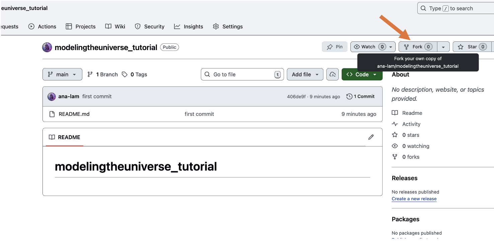
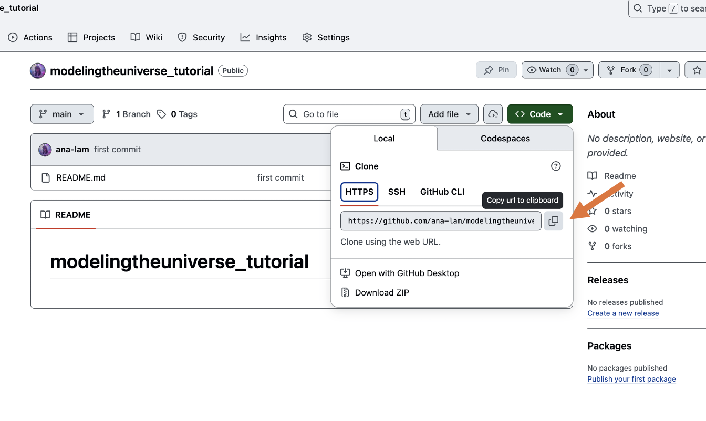
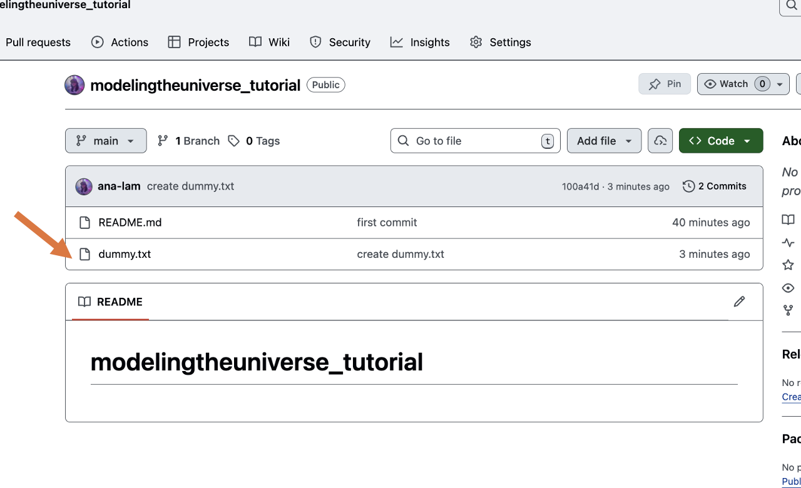
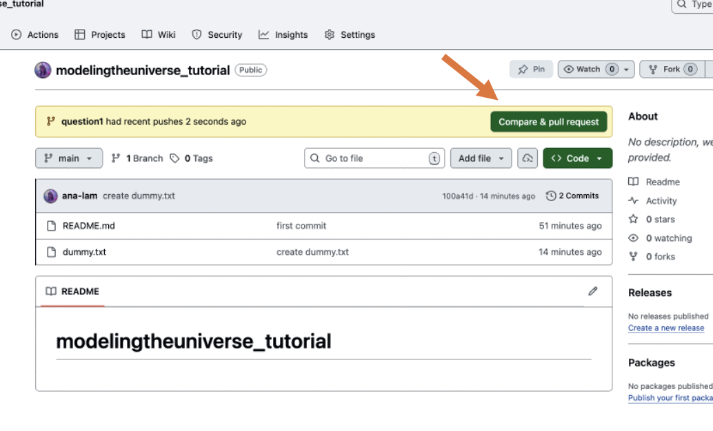
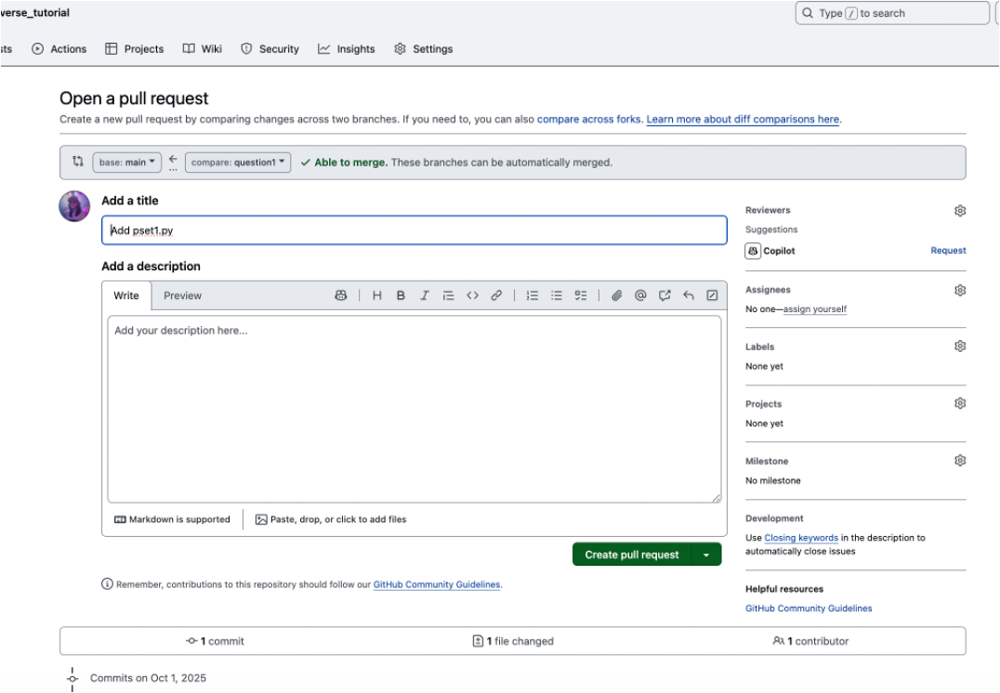
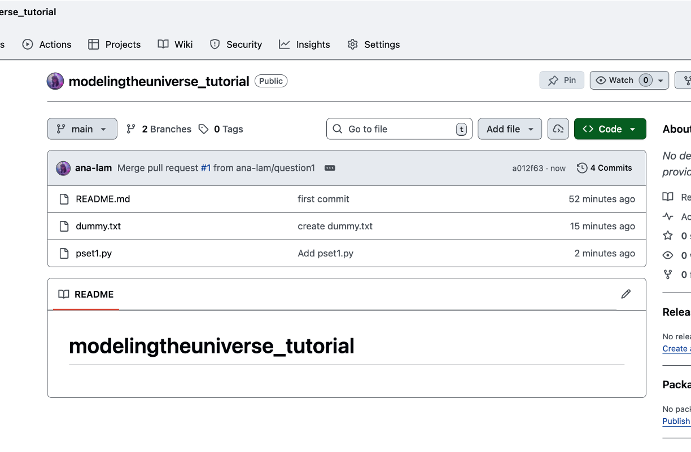
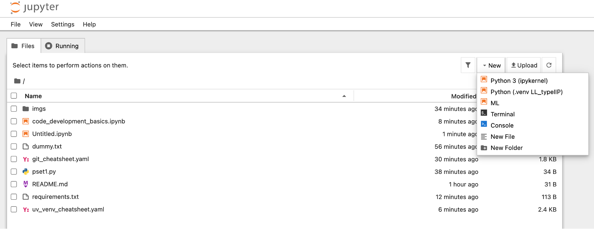

# Modeling the Universe Tutorial

This is a tutorial going over some computational workflow basics that will be useful for students in GU4260 Modeling the Universe course in the Columbia Astronomy Department.

## `git`, GitHub, + Code Development Basics

Ana Lam

Oct. 2, 2025

### Getting Started with `git` and GitHub

#### 1. Clone a repo (e.g., problem set repo for the class):

To clone a repository (repo), let's first fork my dummy repo found at [here](https://github.com/ana-lam/modelingtheuniverse_tutorial). **Forking** in GitHub simply means creating a personal copy of an existing repository in your own account. To fork simply click the fork icon. 

<div style="text-align: center;">

</div>

Now, this repo should appear in your own GitHub account. We can now go ahead and clone this dummy repo. **Git cloning** is a fundamental `git` command used to create a local copy of an existing Git repo. Once you clone the repo onto your local computer, all the files and commit history of that repo will appear in your local copy of that repo. 

Let's go ahead and clone the dummy repo in the command line and navigate to that repo. First, let's grab the url of our repo so we can easily clone it when at the command line.

<div style="text-align: center;">

</div>


Open a terminal session and do the following:

```bash
foo@bar:~$ cd Documents
foo@bar:Documents$ git clone https://github.com/[your-username]/modelingtheuniverse_tutorial.git
foo@bar:Documents$ cd modelingtheuniverse_tutorial
```

Let's go ahead and check the repo status:

```bash
foo@bar:modelingtheuniverse_tutorial$ git status
```
You should see something like this which will report a) what branch you are on, b) if your branch is up to date with the branch, c) if you have made changes to files in the repo that you haven't committed or added in order to be "tracked" by your `git` history.
```bash
On branch main

No commits yet

nothing to commit (create/copy files and use "git add" to track)
```

As you can see here, we are on the `main` branch and we do not have any commits or created/changed file *to* commit.

#### 2. Git Basics

Now let's learn some git basics. After creating your files or jupyter notebook solutions, you will need to `git add` them in order to track them and `git commit -m "your message"` to commit/save those changes. Let's try creating a dummy file that we will track and save.

```bash
foo@bar:modelingtheuniverse_tutorial$ echo "This is a dummy file." > dummy.txt
foo@bar:modelingtheuniverse_tutorial$ git add dummy.txt
```

Let's take a look at our `git status`:

```bash
foo@bar:modelingtheuniverse_tutorial$ git status
On branch main
Your branch is up to date with 'origin/main'.

Changes to be committed:
  (use "git restore --staged <file>..." to unstage)
	new file:   dummy.txt
```
So we are tracking the changes to that file because we have added it! Let's `git commit` the changes/creation of that file so it will appear in our git history. Our git history is essentially a tracker of all the tiny changes we make to files in a repo. Imagine it like "saving"/version history of a word document. 

With commits we need to pass a message which we flag with `-m`:

```bash
foo@bar:modelingtheuniverse_tutorial$ git commit -m "create dummy.txt" 
[main 100a41d] create dummy.txt
 1 file changed, 1 insertion(+)
 create mode 100644 dummy.txt
```
As you can see here, we've created and changed a file and that commit id is `100a41d`.

Now, we want these changes in our local repo that we've saved to be reflected in our remote repo on github.com! In order to do this we need to push this branch with the changes which is just the simple `git push` operation:

```bash
foo@bar:modelingtheuniverse_tutorial$ git push 
Enumerating objects: 4, done.
Counting objects: 100% (4/4), done.
Delta compression using up to 8 threads
Compressing objects: 100% (2/2), done.
Writing objects: 100% (3/3), 299 bytes | 299.00 KiB/s, done.
Total 3 (delta 0), reused 0 (delta 0), pack-reused 0
To github.com:ana-lam/modelingtheuniverse_tutorial.git
   406de9f..100a41d  main -> main
```

And voila! You should see the creation of dummy.txt and it's commit message in github.

<div style="text-align: center;">

</div>

#### 3. Working with Git Branches

Branches in Git let you **work on new features, bug fixes, or problem set solutions** without interfering with the `main` branch. Think of them as "parallel copies" of your repo where you can make changes safely without necessarily saving them to a "final" version of your repo.

Let's check our current branches:

```bash
foo@bar:modelingtheuniverse_tutorial$ git branch -a
* main
  remotes/origin/main
```

The `*` indicates the branch you're currently on (here, `main`). As you can see that is our only branch and it tracks/pushes to `remotes/origin/main`, the github.com/remote version of your main branch.

Let's create a new branch:
```bash
foo@bar:modelingtheuniverse_tutorial$ git checkout -b question1
Switched to a new branch 'question1'
```

Since the `question1` branch does not exist yet, when we `git checkout` this branch we will both create it and switch to it.

```bash
foo@bar:modelingtheuniverse_tutorial$ git branch
  main
* question1
```

We can now make changes in this branch and save them, for example:

```bash
foo@bar:modelingtheuniverse_tutorial$ echo "print('Hello from Problem Set 1')" > pset1.py
foo@bar:modelingtheuniverse_tutorial$ git add pset1.py
foo@bar:modelingtheuniverse_tutorial$ git commit -m "Add pset1.py"
```

And push those changes to the remote version of this branch:

```bash
foo@bar:modelingtheuniverse_tutorial$ git push -u origin question1
```
The `-u` sets this branch to track the remote one, so in the future you can just `git push`.

If you are happy with the changes in this branch and want to them in our `main` branch you can open a pull request in github.com.

<div style="text-align: center;">

</div>

You will be prompted to add a description of this pull request you create. The pull request is essentially a request to `pull` the changes in the `question1` branch into the `main` branch.

<div style="text-align: center;">

</div>

Then simply click **Merge pull request** to merge the pull request.

<div style="text-align: center;">

</div>

### Code Development Best Practices + Environment Workflows

Now an important part of developing code for scientific projects (especially in collaborative settings and for the sake of reproducibility) is the follow some best practices of environment management on top of the github workflow for version tracking.

Staying organized with environments is important because different projects/problem sets might need different packages/libraries or even different versions of said packages/libraries. 

To avoid conflicts, it is a good practice to use a `per-repo isolated environment` instead of installing several packages globally on your computer. **[`uv`](https://docs.astral.sh/uv/) is a very helpful and powerful tool for this.**

[`uv`](https://docs.astral.sh/uv/) is a fast and efficient Python package and environment manager. It creates lightweight virtual environments, installs dependencies and keeps them reproducible, and keeps environments clean on a `per-repo` basis.

### Setting up a Project/Repo Environment with `uv`

#### 1. Create an environment

Inside your repo/problem set directory, let's create a virtual environment. 

```bash
foo@bar:modelingtheuniverse_tutorial$ uv venv
```

This will create a `.venv/` folder inside your repo. This is a hidden folder that contains its own Python and common Python libraries/packages + additional ones you add.

We can activate this virtual environment like so:

```bash
foo@bar:modelingtheuniverse_tutorial$ source .venv/bin/activate
(modelingtheuniverse_tutorial) foo@bar:modelingtheuniverse_tutorial$
```

#### 2. Installing packages
You can now add packages:

```bash
(modelingtheuniverse_tutorial) foo@bar:modelingtheuniverse_tutorial$ uv pip install astropy
```

You can save all the installed packages so collaborators can reproduce your code by doing the following which will create a `requirements.txt` file with the packages listed:

```bash
(modelingtheuniverse_tutorial) foo@bar:modelingtheuniverse_tutorial$ uv pip freeze > requirements.txt
```

In the future, you can transfer this `requirements.txt` file to other repos and install it in other `uv` virtual environments by doing the following:

```bash
(another_venv) foo@bar:[another_repo]$ uv pip install -r requirements.txt
```

#### 3. Best Practies

- Always activate your environment before running code or Jupyter notebooks.

- Keep a requirements.txt in every repo.

- If you break your environment, you can safely delete .venv/ and recreate it with `uv venv` + `uv pip install -r requirements.txt`.

### Working with Jupyter Notebooks

Jupyter notebooks are very useful tools. They are essentially interactive documents where you can code and add markdown (text explanations). This is a Jupyter notebook!

#### 1. Launching a Jupyter Notebook from the command line

To launch a notebook simply run:

```bash
(modelingtheuniverse_tutorial) foo@bar:modelingtheuniverse_tutorial$ jupyter notebook
```

*** If this doesn't work first run `uv pip install notebook` to install the classic interface

This will open a browser window at http://localhost:8888 where you can create and run notebooks (.ipynb files).

<div style="text-align: center;">

</div>

#### 2. Jupyter Notebooks in VS Code

I highly suggest using Jupyter Notebooks in VS code. VS Code is a very powerful code editor that comes with many extensions (including Jupyter + Github) that make things much easier. 

To do this, install VS Code and in the extensions tab download the Python extension and the Jupyter extension. This will allow you to edit interactive `.ipynb` notebooks and you can easily select your environments (like `.venv`) as the **kernel**. Kernels are the engines that run your code. Kernels are tied to specific environments like the one we created. You can follow this [YouTube video](https://www.youtube.com/watch?v=9FZzw9nF8Rg) that goes through the steps of downloading the Jupyter extension in VS Code.
